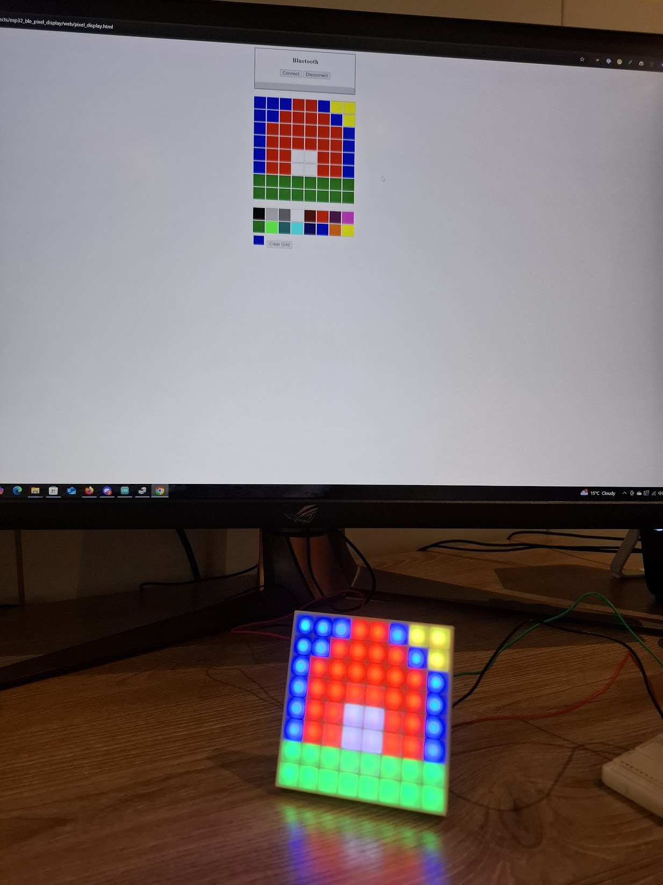

# ESP32 BLE Pixel Display

A project for controlling an 8x8 pixel or LED matrix display using an ESP32 microcontroller over Bluetooth Low Energy (BLE). The ESP32 acts as a BLE server, allowing remote devices (such as a web browser) to send pixel data and control the display wirelessly.



## Features

- BLE server for wireless pixel data transmission
- Supports custom LED matrix or pixel displays (default: 8x8 WS2812B)
- Web-based client for drawing and saving pixel patterns
- Save and load up to 4 display patterns on the ESP32
- Adjustable brightness and persistent storage using NVS

## Getting Started

### 1. Clone the Repository

```sh
git clone https://github.com/KYLEADDIS/esp32_ble_pixel_display.git
cd esp32_ble_pixel_display
```

### 2. Configure and Flash the ESP32

- Open the .ino file in Arduino and flash it to an ESP-32
- The data pin for the LED panel is 22

### 3. Connect and Control

- Use pixel_display.html to connect and draw on the pixel display
- There is also a Github page availalbe at [pixel_display.html](https://kyleaddis.github.io/esp32_ble_pixel_display/web/pixel_display.html)

## License

MIT License. See [LICENSE](LICENSE) for details.

## Author

Kyle Addis


